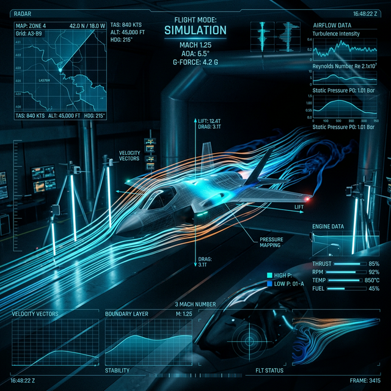

<p align="center">
  
</p>

# 🚀 Aero-Seeker: Wind Tunnel Simulation Lab

[](https://reactjs.org/)
[](https://www.typescriptlang.org/)
[](https://vitejs.dev/)
[](https://threejs.org/)
[](https://docs.pmnd.rs/react-three-fiber)
[](https://tailwindcss.com/)
[](https://zustand-demo.pmnd.rs/)
[](https://immersiveweb.dev/)
[](./LICENSE)
[](https://aero-seeker-3qk6q90pnd.vercel.app/)

**Aero-Seeker** 是一個基於 **React Three Fiber** 與 **Three.js** 構建的科幻風格空氣動力學 / 風洞模擬視覺化實驗室 (Wind Tunnel Lab)。本專案模擬了虛擬飛行器 (F-35 Lightning II) 在不同環境參數 (馬赫數、攻角、側滾等) 下的氣流與激波 (Shockwave) 反應，並透過高科技感 (Sci-Fi) 的 HUD 介面呈現即時遙測數據。

---

## 🔗 Demo

- **🌐 線上展示 (Live Demo):** [https://aero-seeker-3qk6q90pnd.vercel.app/](https://aero-seeker-3qk6q90pnd.vercel.app/)

---

## ✨ 核心特色 (Key Features)

### 🎮 模擬核心
- **GPGPU 粒子氣流系統** — 使用 `GPUComputationRenderer` 在 GPU 上即時運算 1M+ 粒子的流場位移，實現高效能氣流流線渲染
- **動態激波錐 (Vapor Cone)** — 馬赫數超過 1.0 時，透過自訂 GLSL Shader 自動計算馬赫角 (μ = arcsin(1/M)) 並生成視覺化衝擊波
- **氣動力表面著色器** — 自訂 Vertex/Fragment Shader 即時反映密度、壓力與馬赫數對機體材質的影響
- **失速模擬** — 攻角超過安全範圍 (±25°) 時，觸發鏡頭震動效果 (`cameraShake`) 與失速警告

### 🛸 飛行器系統
- **F-35 Lightning II 程序化模型** — 使用 Three.js 幾何原語 (`ExtrudeGeometry`, `CylinderGeometry`) 構建，含主翼、尾翼、進氣道、DSI 凸包及引擎噴焰
- **引擎光暈動畫** — 隨馬赫數動態調整雙層 (inner/outer) 引擎噴焰的比例、顏色與透明度
- **自訂模型匯入** — 支援拖放 (Drag & Drop) 外部 3D 模型置換預設飛行器

### 📟 HUD 與遙測
- **Sci-Fi HUD** — 底部遙測列 (HUDBar) 即時顯示馬赫數、攻角、側滾、偏航等飛行參數
- **MFD 多功能面板** — 右側面板含飛行數據、圖表 (Chart.js) 與測試點 (Test Points) 標籤頁
- **數據矩陣 (Data Matrix)** — 可展開的全參數矩陣視圖
- **遙測錄製** — 支援即時錄製飛行參數並匯出

### 🎛️ 多模態輸入控制
- **鍵盤控制** — `W/S` 加減速、`Q/E` 側滾、`A/D` 偏航，含快捷鍵提示面板
- **滑鼠 Pointer Lock** — 右鍵鎖定滑鼠控制攻角與偏航，滾輪調整相機距離
- **Gamepad 搖桿** — 完整手把支援 (雙搖桿 + 扳機加減速)
- **語音控制 (Web Speech API)** — 支援中文語音指令 (如「馬赫 1.5」、「展開矩陣」)

### 🔊 空間音效
- **Spatial Audio** — 基於 Web Audio API 的 3D 空間音效，引擎聲響隨距離衰減
- **馬赫數連動** — 引擎音調 (playbackRate) 隨馬赫數動態變化

### 🎨 視覺效果
- **Post-Processing** — 可切換 Bloom 後製效果 (`@react-three/postprocessing`)
- **ACES Filmic Tone Mapping** — 電影級色調映射
- **掃描線 (Scanlines)** — CSS 全屏掃描線疊加，模擬 CRT 顯示器質感
- **半透明磨砂面板** — Backdrop Blur + 螢光色系打造沉浸式體驗

### 🥽 虛擬實境 (VR/XR)
- **WebXR 支援** — 整合 `@react-three/xr` v5，支援 VR 頭戴式顯示器 (HMD) 沉浸式體驗
- **XR 狀態同步** — 專屬 `useXRSession` Hook 將 XR 會話狀態同步至全域 Zustand Store
- **智慧控制轉換** — 進入 VR 模式後自動鎖定桌面攝影機控制，改由 HMD 追蹤控制視角，並停用與 XR 不相容的後置處理 (Bloom) 以確保雙眼渲染效能
- **內建 VR 按鈕** — 頂部控制面板整合動態狀態按鈕 (進入 VR / 退出 VR)

---

## 🛠️ 技術棧 (Tech Stack)

| 技術 | 版本 | 用途 |
| :--- | :--- | :--- |
| **React** | 18.3 | 元件化 UI 框架 |
| **TypeScript** | 5.7 | 靜態型別安全 |
| **Three.js** | r170 | 3D 渲染引擎 |
| **React Three Fiber** | 8.17 | React 聲明式 Three.js 整合 |
| **@react-three/drei** | 9.121 | R3F 擴展工具函式 |
| **@react-three/postprocessing** | 2.16 | 後製效果 (Bloom) |
| **Zustand** | 5.0 | 全域狀態管理 (Single Source of Truth) |
| **Vite** | 6.2 | 極速開發伺服器與打包工具 |
| **vite-plugin-glsl** | 1.3 | GLSL Shader 模組匯入 |
| **Tailwind CSS** | 4.1 | 原子化 CSS 框架 |
| **Chart.js** | 4.4 | 遙測數據圖表 |
| **@react-three/xr** | 5.7 | WebXR (VR/AR) 整合 |
| **Docker + Nginx** | — | 容器化部署方案 |

---

## 📂 專案架構 (Project Architecture)

```text
aero-seeker/
├── public/                             # 靜態資源 (Hero Image, Favicon)
├── src/
│   ├── main.tsx                        # 應用程式入口
│   ├── App.tsx                         # 根元件 — 啟動全域 Hooks (鍵盤/手把/語音)
│   │
│   ├── layouts/                        # 頁面佈局層
│   │   ├── SimulationLayout.tsx        # 主佈局 — 組合 3D Canvas + HUD + 面板
│   │   └── MobileBlocker.tsx           # 行動裝置不兼容提示
│   │
│   ├── features/                       # Feature-Sliced 模組 (各功能獨立封裝)
│   │   ├── wind-tunnel/                # 🌊 風洞核心
│   │   │   ├── components/
│   │   │   │   ├── SceneContainer.tsx  #   R3F Canvas 根 + 動畫迴圈 (useFrame)
│   │   │   │   ├── JetModel.tsx        #   F-35 程序化幾何模型
│   │   │   │   ├── GPGPUParticles.tsx  #   GPGPU 粒子渲染元件
│   │   │   │   ├── VaporCone.tsx       #   激波錐視覺化
│   │   │   │   └── DropZoneOverlay.tsx #   自訂模型拖放覆蓋層
│   │   │   ├── hooks/
│   │   │   │   ├── useGPGPUCompute.ts  #   GPU 粒子位置運算 Hook
│   │   │   │   ├── useAeroMaterial.ts  #   氣動力學材質 Shader Hook
│   │   │   │   └── useModelLoader.ts   #   模型載入 Hook
│   │   │   └── utils/
│   │   │       └── createSmokeTexture.ts # 程序化煙霧貼圖
│   │   │
│   │   ├── controls/                   # 🎛️ 輸入控制模組
│   │   │   ├── components/
│   │   │   │   ├── ControlPanel.tsx    #   參數控制面板 (左上)
│   │   │   │   ├── EnvironmentPanel.tsx#   環境參數面板 (左下)
│   │   │   │   └── KeyboardHints.tsx   #   鍵盤快捷鍵提示
│   │   │   └── hooks/
│   │   │       ├── useKeyboardControl.ts  # 鍵盤控制 Hook
│   │   │       ├── usePointerControl.ts   # 滑鼠 Pointer Lock Hook
│   │   │       ├── useGamepadController.ts# Gamepad 手把 Hook
│   │   │       ├── useVoiceControl.ts     # 語音控制 Hook
│   │   │       ├── useXRSession.ts        # XR 會話同步 Hook
│   │   │       ├── useSpatialAudio.ts     # 3D 空間音效 Hook
│   │   │       └── useDeviceCheck.ts      # 裝置相容性檢測
│   │   │
│   │   └── telemetry/                  # 📊 遙測資料模組
│   │       ├── components/
│   │       │   ├── HUDBar.tsx          #   底部遙測列
│   │       │   ├── MFDPanel.tsx        #   右側多功能顯示面板
│   │       │   └── DataMatrix.tsx      #   全參數矩陣展開視圖
│   │       ├── hooks/
│   │       │   └── useTelemetryRecorder.ts # 遙測錄製 Hook
│   │       └── data/
│   │           └── testPoints.ts       #   預設測試資料點
│   │
│   ├── shaders/                        # 🎨 GLSL Shader 程式
│   │   ├── gpgpuPosition.glsl          #   粒子位置 GPGPU 運算 Shader
│   │   ├── aeroSurface.vert.glsl       #   氣動力表面 Vertex Shader
│   │   ├── aeroSurface.frag.glsl       #   氣動力表面 Fragment Shader
│   │   ├── smokeParticle.vert.glsl     #   煙霧粒子 Vertex Shader
│   │   ├── smokeParticle.frag.glsl     #   煙霧粒子 Fragment Shader
│   │   ├── vaporCone.vert.glsl         #   激波錐 Vertex Shader
│   │   └── vaporCone.frag.glsl         #   激波錐 Fragment Shader
│   │
│   ├── store/                          # 📦 全域狀態
│   │   └── useSimulationStore.ts       #   Zustand Store (模擬參數/相機/輸入/遙測)
│   │
│   ├── shared/                         # 🔧 共享資源
│   │   ├── constants/
│   │   │   ├── simulation.ts           #   模擬常數 (風洞長度、粒子數、相機等)
│   │   │   └── materials.ts            #   材質預設配置
│   │   └── ui/
│   │       ├── CyberButton.tsx         #   科幻風格按鈕
│   │       ├── CyberPanel.tsx          #   科幻風格面板容器
│   │       └── CooldownDialog.tsx      #   冷卻時間對話框
│   │
│   ├── utils/                          # 🧮 工具函式
│   │   ├── flightStateClassifier.ts    #   飛行狀態分類器 (亞音速/跨音速/超音速)
│   │   ├── engineGlowHelper.ts         #   引擎光暈計算
│   │   └── cameraShake.ts              #   相機震動效果
│   │
│   └── styles/
│       └── globals.css                 #   全域 CSS (Tailwind imports + 掃描線動畫)
│
├── Dockerfile                          # 多階段 Docker 建構 (Node build → Nginx)
├── docker-compose.yml                  # Docker Compose 編配
├── nginx.conf                          # Nginx 靜態檔案伺服器配置
├── vite.config.ts                      # Vite 配置 (React + Tailwind + GLSL plugins)
├── tsconfig.json                       # TypeScript 專案參照
├── tsconfig.app.json                   # App TypeScript 配置
└── tsconfig.node.json                  # Node (Vite config) TypeScript 配置
```

---

## 🧠 核心邏輯解析 (Core Concepts)

### 1. GPGPU 粒子流場 (`useGPGPUCompute` + `gpgpuPosition.glsl`)

使用 Three.js `GPUComputationRenderer` 在 GPU Shader 中進行大規模粒子位置運算：

- **粒子網格初始化** — 在 `LINES_Y × LINES_Z` (32×32) 的二維截面上佈置流線，每條流線含 `POINTS_PER_LINE` (1024) 個粒子
- **流場算法** — 粒子位置透過向量 `(vx, vy, vz)` 即時運算，並受飛行器體積的「排斥」作用，模擬真實繞流效果
- **Shader Uniforms** — 每幀傳入 `time`, `windSpeed`, `objMatrix`, `objInvMatrix`, `uObjectType`, `uCustomSize`，在 GPU 端完成碰撞檢測與位移計算

### 2. 激波錐視覺化 (`VaporCone` + `vaporCone.glsl`)

- 計算公式：**μ = arcsin(1/M)**
- 當 **Mach > 1.0** 時，透過自訂 GLSL Shader 動態調整激波錐角度、透明度及高光效果
- 混合多層透明度與 Fresnel 效果，增強視覺真實感

### 3. 氣動力表面材質 (`useAeroMaterial` + `aeroSurface.glsl`)

- 自訂 Vertex/Fragment Shader 替代標準 `MeshStandardMaterial`
- 根據馬赫數與攻角即時計算表面壓力分佈，映射為色溫變化
- 密度參數影響環境反射與漫反射比例

### 4. 全域狀態管理 (`useSimulationStore`)

採用 Zustand 作為 **Single Source of Truth**，管理所有模擬狀態：

```
SimulationState
├── 模擬參數 — mach, windSpeed, aoa, roll, yaw, density, smokeSize ...
├── 相機狀態 — camTheta, camPhi, targetRadius, isCameraTweening ...
├── 輸入狀態 — keys, isPointerLocked, targetAoA, targetYaw, targetRoll
├── 遙測紀錄 — isRecording, telemetryData, activeTab, showMatrix
├── 模型參照 — customModelGroup, customModelMaterials
└── 裝置狀態 — isVoiceActive, gamepadConnected, showCooldown
```

### 5. 動畫迴圈 (`SceneContainer` → `useFrame`)

所有即時更新邏輯統一在 R3F `useFrame` 中執行：

1. 讀取鍵盤/搖桿輸入 → 更新飛行參數 (mach, aoa, roll, yaw)
2. 平滑插值 (Lerp) 應用目標值 → 旋轉飛行器群組
3. 同步更新 GPGPU 粒子、Shader Uniforms、引擎光暈
4. 相機軌道控制 / Tween 動畫 / 失速震動

### 6. VR/XR 整合架構 (`@react-three/xr`)

為了在 React 架構下完美移植 WebXR 邏輯，專案實作了以下機制：

- **XR Wrapper**：使用 `<XR>` 組件包裹 3D 場景，統一管理 WebXR Session。
- **Session Bridge**：透過 `useXRSession` Hook 封裝 `useXR` 狀態，將 `isPresenting` 布林值推送到 Zustand 全域 Store，確保 UI 面板能根據 VR 狀態切換樣式。
- **Render Guard**：進入 VR 後，自動將攝影機 `useFrame` 控制權釋放（由 HMD 接管），並關閉 `EffectComposer` (Bloom)，避免雙眼渲染偏移與效能抖動。
- **UI Integration**：在 `ControlPanel` 中嵌入 `<VRButton>`，並透過 CSS 覆蓋 (Overlay) 實現符合 Sci-Fi 風格的狀態呈現。

---

## 🚀 快速開始 (Getting Started)

### 前置準備
- **Node.js** v18+
- **npm** 或 **yarn**

### 開發模式

```bash
# 1. 複製專案
git clone https://github.com/your-username/aero-seeker.git
cd aero-seeker

# 2. 安裝依賴
npm install

# 3. 啟動開發伺服器
npm run dev

# 4. 開啟瀏覽器訪問 http://localhost:5173
```

### Docker 部署

```bash
# 使用 Docker Compose 一鍵部署
docker compose up -d

# 訪問 http://localhost:8080
```

### 建構產出

```bash
# TypeScript 編譯 + Vite 打包
npm run build

# 預覽產出結果
npm run preview
```

---

## ⌨️ 操作指南 (Controls)

| 輸入方式 | 操作 | 說明 |
| :--- | :--- | :--- |
| **鍵盤** `W` / `S` | 加速 / 減速 | 調整馬赫數 |
| **鍵盤** `Q` / `E` | 左滾 / 右滾 | 調整側滾角 |
| **鍵盤** `A` / `D` | 左偏 / 右偏 | 調整偏航角 |
| **滑鼠右鍵** | Pointer Lock | 鎖定游標控制攻角 / 偏航 |
| **滾輪** | 縮放 | 調整相機距離 |
| **Gamepad 左搖桿** | 側滾 / 攻角 | 類比搖桿控制 |
| **Gamepad 扳機** | 加速 / 減速 | RT 加速 / LT 減速 |
| **語音** | 「馬赫 1.5」 | 中文語音指令調整參數 |
| **VRButton** | 點擊標籤 | 進入 / 退出 VR 沉浸模式 |


---

## 📝 授權 (License)

本專案採用 **[MIT License](./LICENSE)** 授權。

---

<p align="center">
  Built with ❤️ by Cosmo Chang | Exploring the boundaries of Aerospace & Web Tech.
</p>
